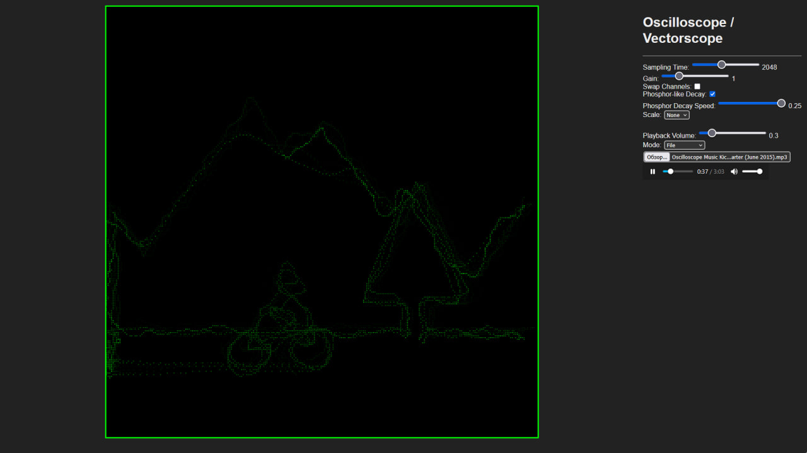

# OscilloScope-XY

A real-time **XY Oscilloscope / Vectorscope** running directly in your browser.  
Visualize audio signals from files or microphone using Web Audio API.

---

## Live Demo
Try it live in your browser: [Click here](https://gibsy.github.io/OscilloScope-XY-WEB/)

You can try this with example sounds from repo

## Credits

This project is based on the original work:

- **[XaudYo](https://github.com/H3wastooshort/XaudYo/tree/main)** by [H3wastooshort](https://github.com/H3wastooshort)

### Modifications by Me:
- UI redesign
- Grid scale rendering
- Visual signal improvements
- Code optimization
- Minor functional enhancements
- Bug fix ( but there is at least one bug with the grid, i am too lazy to fix )
